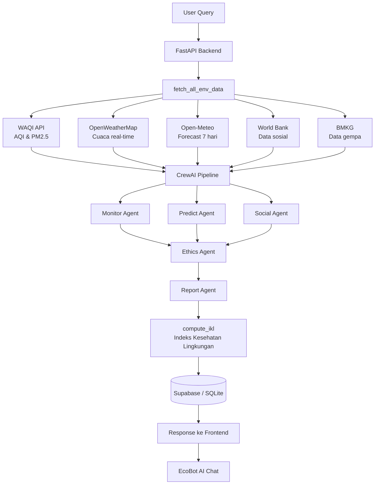

# 🌿 EcoGuardian AI

Sistem multi-agent AI berbasis **CrewAI** untuk memantau kondisi lingkungan, memprediksi risiko iklim, dan menganalisis dampak sosial secara real-time. Didukung data dari berbagai API publik gratis dan LLM via Groq.

---

## 🤖 Agen AI

| Agen | Peran |
|------|-------|
| 🌫️ **Monitor Agent** | Analisis kualitas udara (AQI, PM2.5) dan cuaca real-time berbasis standar WHO/ISPU |
| 📈 **Predict Agent** | Prediksi risiko banjir dan polusi dari prakiraan cuaca 7 hari ke depan |
| 👥 **Social Agent** | Penilaian dampak lingkungan pada kelompok rentan dengan perspektif keadilan sosial |
| 🛡️ **Ethics Auditor** | Validasi output semua agen: bias, transparansi, keadilan, akurasi data |
| 📋 **Report Agent** | Laporan komprehensif dengan rencana aksi terstruktur dan terukur |

Pipeline: Monitor + Predict + Social berjalan **paralel** → Ethics → Report berjalan **sequential**.

---

## �️ Arsitektur



---

## � Fitur

- **Analisis multi-kota** — kota-kota Indonesia dan beberapa kota Asia (Singapore, KL, Bangkok, Tokyo)
- **Peta choropleth** — visualisasi cuaca per 34 provinsi Indonesia via Leaflet.js
- **Indeks Kesehatan Lingkungan (IKL)** — skor gabungan 0–100 dari AQI, risiko, sosial, dan suhu
- **Guardian AI Chat** — tanya jawab lanjutan berbasis konteks analisis terakhir
- **Auto-Monitor** — endpoint periodik cek kondisi berbahaya tanpa analisis AI penuh
- **Download laporan** — export hasil analisis ke file `.txt`
- **Share laporan** — bagikan hasil via link unik (`/share/{id}`)
- **Statistik global** — distribusi risiko, top kota, heatmap per jam dari Supabase
- **Notifikasi** — alert otomatis via Telegram dan laporan via Email (opsional)
- **Dual database** — Supabase (cloud) dengan fallback otomatis ke SQLite (lokal)
- **Dark/Light mode** dan **responsive design**

---

## 🌐 API Publik

| API | Penyedia | Penggunaan |
|-----|----------|------------|
| [WAQI](https://aqicn.org/json-api/doc/) | World Air Quality Index | AQI, PM2.5, polutan udara |
| [OpenWeatherMap](https://openweathermap.org/api) | OpenWeather Ltd | Cuaca real-time, geocoding |
| [Open-Meteo](https://open-meteo.com/en/docs) | Open-Meteo.com | Prakiraan 7 hari (tanpa API key) |
| [World Bank](https://datahelpdesk.worldbank.org) | World Bank Group | Kemiskinan, sanitasi, air bersih |
| [BMKG](https://data.bmkg.go.id) | BMKG Indonesia | Data gempa bumi terbaru |
| [Leaflet](https://leafletjs.com) | OpenStreetMap Foundation | Peta interaktif |

---

## 🛠️ Stack

- **Backend** — Python 3.11+, FastAPI, Uvicorn
- **AI / LLM** — CrewAI ≥0.80.0, Groq API (`llama-3.1-8b-instant`)
- **Database** — Supabase (PostgreSQL) + SQLite fallback
- **Frontend** — HTML5, CSS3, JavaScript (ES2022), Leaflet.js

---

## ⚙️ Instalasi

### 1. Buat virtual environment

```bash
python -m venv .venv

# Windows
.venv\Scripts\activate

# Linux / Mac
source .venv/bin/activate
```

### 2. Install dependencies

```bash
pip install -r requirements.txt
```

### 3. Konfigurasi `.env`

Buat file `.env` di root project:

```env
# Wajib
GROQ_API_KEY=your_groq_key
OPENWEATHER_API_KEY=your_openweather_key
WAQI_TOKEN=your_waqi_token

# Supabase (opsional — fallback ke SQLite jika tidak diisi)
SUPABASE_URL=https://your-project.supabase.co
SUPABASE_KEY=your_supabase_anon_key

# Notifikasi Telegram (opsional)
TELEGRAM_BOT_TOKEN=your_bot_token
TELEGRAM_CHAT_ID=your_chat_id

# Notifikasi Email (opsional)
EMAIL_SENDER=your@gmail.com
EMAIL_PASSWORD=your_app_password
EMAIL_RECIPIENT=recipient@email.com
```

### 4. Jalankan server

```bash
python main.py
```

Buka browser: `http://127.0.0.1:8080`

---

## 🗄️ Setup Supabase

Jalankan file `supabase_setup.sql` di **Supabase SQL Editor** (Dashboard → Project → SQL Editor).

File tersebut akan membuat:

| Tabel | Fungsi |
|-------|--------|
| `sessions` | Riwayat pesan chat per sesi |
| `analysis_history` | Riwayat analisis (kota, risiko, ringkasan) |
| `shared_reports` | Laporan yang di-share via link unik |

Sudah termasuk index untuk performa query dan Row Level Security (RLS) dengan policy `allow_all` untuk anon key.

> Jika Supabase tidak dikonfigurasi, sistem otomatis menggunakan SQLite lokal di `data/ecoguardian.db`.

---

## 🔌 API Endpoints

| Method | Endpoint | Deskripsi |
|--------|----------|-----------|
| `GET` | `/` | Dashboard utama |
| `POST` | `/api/analyze` | Analisis lingkungan lengkap (5 agen) |
| `GET` | `/api/auto-monitor/{city}` | Cek kondisi berbahaya tanpa AI penuh |
| `GET` | `/api/weather/{city}` | Data cuaca & forecast |
| `GET` | `/api/indonesia-weather-map` | Data cuaca 34 provinsi untuk choropleth |
| `POST` | `/api/guardian-chat` | Guardian AI Chat |
| `GET` | `/api/stats` | Statistik global dari Supabase |
| `POST` | `/api/share-report` | Simpan & share laporan |
| `GET` | `/share/{share_id}` | Tampilkan laporan yang di-share |
| `GET` | `/api/download-report` | Download laporan `.txt` |
| `GET` | `/api/cities` | Daftar kota yang didukung |
| `GET` | `/api/health` | Health check |

---

*Semua API yang digunakan adalah layanan publik gratis atau memiliki free tier.*
