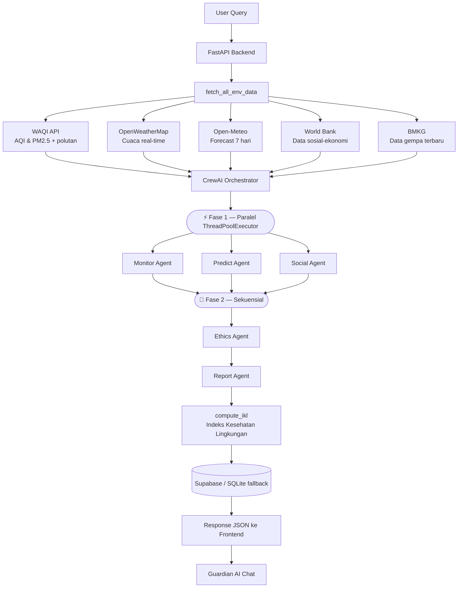

# 🌿 EverGreen AI

Sistem **Agentic AI** berbasis multi-agent untuk memantau kondisi lingkungan, memprediksi risiko iklim, dan menganalisis dampak sosial secara real-time. Sistem ini berpikir, merencanakan, dan bertindak secara otonom — menghasilkan laporan lengkap dengan rencana aksi konkret dalam hitungan menit.

Didukung data dari 5 API publik gratis dan LLM **Groq Llama-4 Scout 17B** via CrewAI.

---

## 🤖 Pipeline Multi-Agent

Lima agen AI bekerja secara terkoordinasi dalam dua fase:

**Fase 1 — Paralel** (Monitor + Predict + Social berjalan bersamaan):

| Agen | Persona | Peran |
|------|---------|-------|
| 🌫️ **Monitor Agent** | Dr. Rina — Ilmuwan KLHK | Analisis AQI, PM2.5, polutan dominan vs standar WHO/ISPU dengan Chain-of-Thought 5 langkah |
| 📈 **Predict Agent** | Prof. Budi — Klimatologi BMKG | Prediksi risiko banjir & polusi 7 hari ke depan dengan probabilitas dan mekanisme kausal |
| 👥 **Social Agent** | Dr. Siti — Sosiolog Keadilan Lingkungan | Hitung skor kerentanan sosial 0–100, identifikasi kelompok rentan berbasis World Bank |

**Fase 2 — Sekuensial**:

| Agen | Persona | Peran |
|------|---------|-------|
| 🛡️ **Ethics Agent** | Ir. Hasan — Auditor Etika AI | Validasi 4 dimensi: Validitas, Transparansi, Keadilan, Akurasi. Skor etika 0–100 |
| 📋 **Report Agent** | Dr. Arif — Analis Kebijakan | Laporan final dengan reasoning eksplisit dan 3 rencana aksi terstruktur |

---

## 🏗️ Arsitektur



---

## ✨ Fitur

### Analisis & AI
- **5 Agen AI otonom** — pipeline paralel + sekuensial dengan persona spesifik
- **Chain-of-Thought reasoning** — setiap agen menjelaskan langkah analisisnya
- **Deteksi fokus otomatis** — sistem mendeteksi intent query (kualitas udara / cuaca / sosial / aksi / lengkap) dan menyesuaikan output
- **Indeks Kesehatan Lingkungan (IKL)** — skor gabungan 0–100 dari AQI (35%), risiko (25%), sosial (25%), suhu (15%)
- **Guardian AI Chat** — chatbot kontekstual berbasis Groq Llama-4 Scout, memahami konteks analisis terakhir

### Dashboard & Visualisasi
- **Peta choropleth** — data cuaca real-time 34 provinsi Indonesia via Leaflet.js
- **Community Health Index** — skor gabungan kualitas udara, air bersih, sanitasi, kemiskinan
- **Radar chart kerentanan** — visualisasi per kelompok sosial (anak-anak, lansia, ibu, disabilitas)
- **Statistik global** — distribusi risiko, top kota, heatmap analisis per jam dari Supabase
- **Dark/Light mode** dan **responsive design**

### Monitoring & Alert
- **Auto-Monitor** — endpoint periodik cek kondisi berbahaya tanpa analisis AI penuh
- **Alert threshold** berbasis standar WHO/ISPU: AQI, PM2.5, curah hujan, kecepatan angin
- **Level alert**: aman → sedang → tinggi → kritis

### Data & Laporan
- **Download laporan** — export hasil analisis ke file `.txt` dan export PDF terformat
- **Dual database** — Supabase (cloud) dengan fallback otomatis ke SQLite lokal
- **Sumber resmi per negara** — BMKG, KLHK, ISPU, BPS, BNPB (ID), NEA (SG), JMM (MY), dll.

---

## 🌐 API & Sumber Data

| API | Penyedia | Data | API Key |
|-----|----------|------|---------|
| [WAQI](https://aqicn.org/json-api/doc/) | World Air Quality Index | AQI, PM2.5, PM10, O3, NO2, CO | Wajib |
| [OpenWeatherMap](https://openweathermap.org/api) | OpenWeather Ltd | Cuaca real-time, geocoding | Wajib |
| [Open-Meteo](https://open-meteo.com/en/docs) | Open-Meteo.com | Prakiraan 7 hari (suhu, hujan, angin, UV) | Tidak perlu |
| [World Bank](https://datahelpdesk.worldbank.org) | World Bank Group | Kemiskinan, sanitasi, air bersih, listrik, internet | Tidak perlu |
| [BMKG](https://data.bmkg.go.id) | BMKG Indonesia | Data gempa bumi terbaru | Tidak perlu |

---

## 🛠️ Tech Stack

| Layer | Teknologi |
|-------|-----------|
| **Backend** | Python 3.11+, FastAPI 0.115, Uvicorn 0.30 |
| **AI / LLM** | CrewAI ≥0.80.0, Groq API — `meta-llama/llama-4-scout-17b-16e-instruct` |
| **HTTP Client** | httpx ≥0.27 (async) |
| **Database** | Supabase (PostgreSQL cloud) + SQLite fallback (`data/ecoguardian.db`) |
| **Frontend** | HTML5, CSS3, JavaScript ES2022, Leaflet.js, Canvas API |
| **Config** | python-dotenv, Pydantic v2 |

---

## ⚙️ Instalasi

### 1. Clone & buat virtual environment

```bash
git clone <repo-url>
cd EverGreen-AI

python -m venv .venv

# Windows
.venv\Scripts\activate

# Linux / Mac
source .venv/bin/activate
```

### 2. Install dependencies

```bash
pip install -r requirements.txt
```

### 3. Konfigurasi `.env`

Buat file `.env` di root project:

```env
# ── Wajib ──────────────────────────────────────────────────
GROQ_API_KEY=your_groq_api_key
OPENWEATHER_API_KEY=your_openweather_api_key
WAQI_TOKEN=your_waqi_token

# ── Supabase (opsional — fallback ke SQLite jika tidak diisi) ──
SUPABASE_URL=https://your-project.supabase.co
SUPABASE_KEY=your_supabase_anon_key

# ── Server (opsional) ──────────────────────────────────────
HOST=127.0.0.1
PORT=8080
DEBUG=false
```

> **Catatan:** Jika `SUPABASE_URL` dan `SUPABASE_KEY` tidak diisi, sistem otomatis menggunakan SQLite lokal di `data/ecoguardian.db`.

### 4. Jalankan server

```bash
python main.py
```

Buka browser: `http://127.0.0.1:8080`

---

## 🗄️ Setup Supabase (Opsional)

Jalankan file `supabase_setup.sql` di **Supabase SQL Editor** (Dashboard → Project → SQL Editor).

File tersebut membuat tiga tabel:

| Tabel | Fungsi |
|-------|--------|
| `sessions` | Riwayat pesan chat per sesi (JSON array) |
| `analysis_history` | Riwayat analisis: kota, query, ringkasan, risk level |

Sudah termasuk index untuk performa query dan Row Level Security (RLS) dengan policy `allow_all` untuk anon key.

---

## 🔌 API Endpoints

| Method | Endpoint | Deskripsi |
|--------|----------|-----------|
| `GET` | `/` | Dashboard utama |
| `POST` | `/api/analyze` | Analisis lingkungan lengkap (5 agen AI) |
| `GET` | `/api/auto-monitor/{city}` | Cek kondisi berbahaya tanpa AI penuh (untuk polling periodik) |
| `GET` | `/api/weather/{city}` | Data cuaca & forecast tanpa analisis AI |
| `GET` | `/api/indonesia-weather-map` | Data cuaca 34 provinsi untuk choropleth map |
| `GET` | `/api/social-features/{city}` | Community Health Index, kerentanan sosial, radar chart |
| `POST` | `/api/guardian-chat` | Guardian AI Chat — tanya jawab kontekstual |
| `GET` | `/api/stats` | Statistik global: distribusi risiko, top kota, heatmap per jam |
| `POST` | `/api/share-report` | Simpan laporan ke Supabase & return link unik |
| `GET` | `/share/{share_id}` | Tampilkan laporan yang di-share (HTML) |
| `GET` | `/api/download-report` | Download laporan `.txt` |
| `GET` | `/api/cities` | Daftar kota yang didukung |
| `GET` | `/api/owm-key` | Expose OWM key untuk weather tile layers |
| `GET` | `/api/health` | Health check & info model AI aktif |

### Contoh Request — Analisis Lengkap

```bash
curl -X POST http://127.0.0.1:8080/api/analyze \
  -H "Content-Type: application/json" \
  -d '{
    "query": "Analisis lengkap kondisi lingkungan",
    "city": "Jakarta",
    "country_code": "ID",
    "session_id": "user-123"
  }'
```

### Contoh Response

```json
{
  "success": true,
  "response": "...",
  "risk_level": "sedang",
  "city": "Jakarta",
  "metrics": { "aqi": 87, "pm25": 32.1, "temperature": 31, "humidity": 78 },
  "forecast": [...],
  "actions": [
    { "prioritas": "tinggi", "pelaku": "Pemerintah DKI", "aksi": "...", "dampak": "..." }
  ],
  "ikl": { "score": 62, "label": "Baik", "color": "#16a34a", "components": [...] },
  "sources": [...],
  "session_id": "user-123"
}
```

---

## 🏙️ Kota yang Didukung

**Indonesia:** Jakarta, Surabaya, Bandung, Medan, Semarang, Makassar, Yogyakarta, Palembang, Pekanbaru, Balikpapan, Samarinda, Pontianak, Manado, Denpasar, Mataram, Kupang, Jayapura, Ambon, Banjarmasin, Serang, Malang, Solo, dan lainnya.

**Asia:** Singapore, Kuala Lumpur, Bangkok, Tokyo.

> Kota lain di luar daftar fallback tetap didukung via geocoding OpenWeatherMap.

---

## 📁 Struktur Project

```
EverGreen-AI/
├── main.py                  # FastAPI app, semua endpoint, alert logic
├── requirements.txt
├── .env                     # API keys (tidak di-commit)
├── supabase_setup.sql       # DDL untuk setup Supabase
│
├── agents/
│   └── orchestrator.py      # CrewAI pipeline, 5 agen, IKL, parse action plan
│
├── tools/
│   ├── env_tools.py         # Fetch data: WAQI, OWM, Open-Meteo, World Bank, BMKG
│   └── notification_tools.py # Generate & simpan laporan .txt
│
├── memory/
│   ├── db.py                # SQLite: sessions, env_cache, analysis_history
│   └── supabase_db.py       # Supabase wrapper dengan fallback ke SQLite
│
├── static/
│   ├── css/style.css
│   └── js/
│       ├── app.js           # Logic utama dashboard
│       └── social_features.js # Community Health Index, radar chart
│
├── templates/
│   └── index.html           # Single-page dashboard
│
└── data/
    ├── ecoguardian.db       # SQLite database (auto-generated)
    └── reports/             # Laporan .txt yang didownload
```

---

## 🔑 Cara Mendapatkan API Key

| API | Link Registrasi | Free Tier |
|-----|----------------|-----------|
| **Groq** | [console.groq.com](https://console.groq.com) | 30.000 token/menit |
| **OpenWeatherMap** | [openweathermap.org/api](https://openweathermap.org/api) | 1.000 calls/hari |
| **WAQI** | [aqicn.org/data-platform/token](https://aqicn.org/data-platform/token/) | Gratis untuk non-komersial |
| **Supabase** | [supabase.com](https://supabase.com) | 500MB database gratis |

---

*Semua API yang digunakan adalah layanan publik gratis atau memiliki free tier yang cukup untuk penggunaan normal.*
